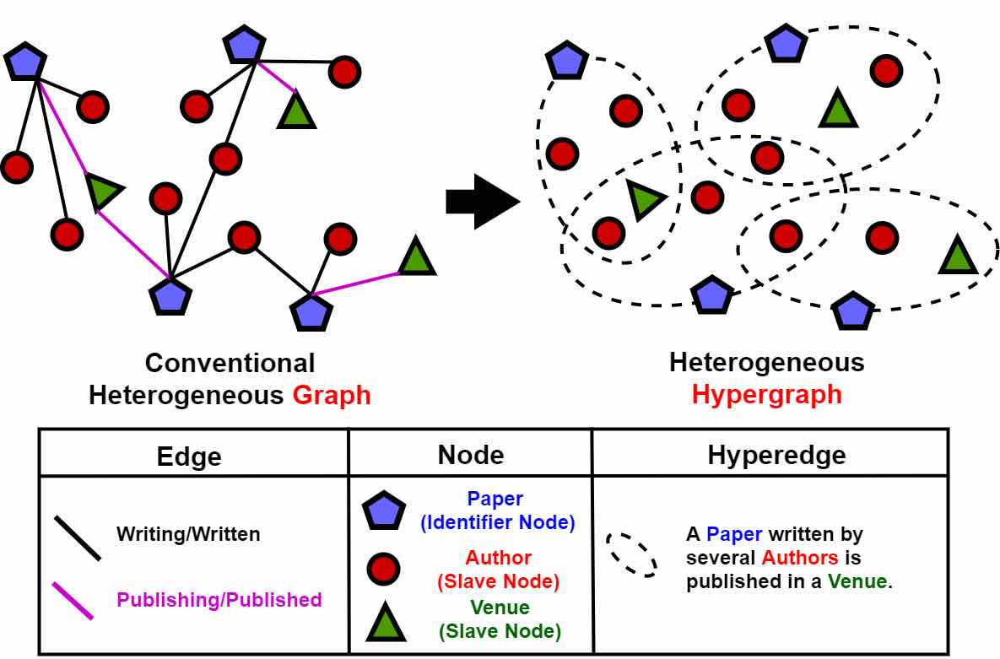
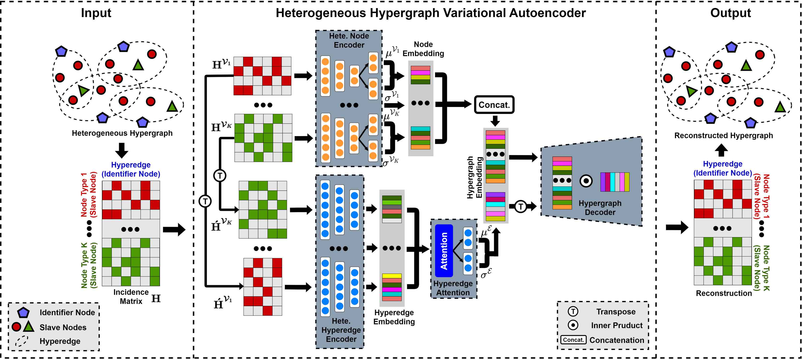

# Heterogeneous Hypergraph Variational Autoencoder for Link Prediction (T-PAMI 2021)





**Abstract:** Link prediction aims at inferring missing links or predicting future ones based on the currently observed network. This topic is important for many applications such as social media, bioinformatics and recommendation systems. Most existing methods focus on homogeneous settings and consider only low-order pairwise relations while ignoring either the heterogeneity or high-order complex relations among different types of nodes, which tends to lead to a sub-optimal embedding result. This paper presents a method named Heterogeneous Hypergraph Variational Autoencoder (HeteHG-VAE) for link prediction in heterogeneous information networks (HINs). It first maps a conventional HIN to a heterogeneous hypergraph with a certain kind of semantics to capture both the high-order semantics and complex relations among nodes, while preserving the low-order pairwise topology information of the original HIN. Then, deep latent representations of nodes and hyperedges are learned by a Bayesian deep generative framework from the heterogeneous hypergraph in an unsupervised manner. Moreover, a hyperedge attention module is designed to learn the importance of different types of nodes in each hyperedge. The major merit of HeteHG-VAE lies in its ability of modeling multi-level relations in heterogeneous settings. Extensive experiments on real-world datasets demonstrate the effectiveness and efficiency of the proposed method.


## Requirements

* Python 3.6
* Tensorflow version 1.10


### Cite
If you make use of this code in your own work, please cite our paper.
```
@article{fan2021heterogeneous,
  title={Heterogeneous Hypergraph Variational Autoencoder for Link Prediction},
  author={Fan, Haoyi and Zhang, Fengbin and Wei, Yuxuan and Li, Zuoyong and Zou, Changqing and Gao, Yue and Dai, Qionghai},
  journal={IEEE Transactions on Pattern Analysis and Machine Intelligence},
  year={2021},
  publisher={IEEE},
  doi={10.1109/TPAMI.2021.3059313}
}
```